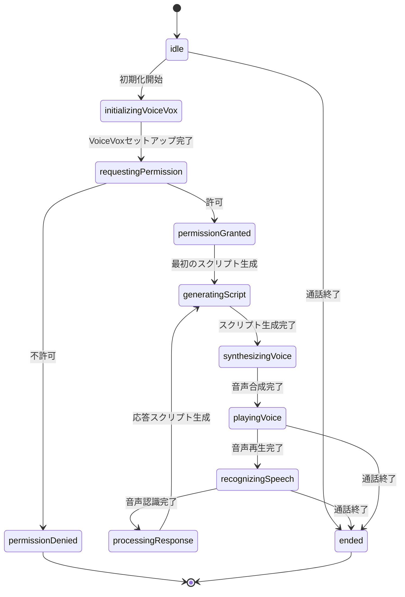

# ZunTalk ドキュメント

## 概要

ZunTalkプロジェクトのドキュメントです。

## Mermaidフローチャートテンプレート

### 基本的なアルゴリズムフローチャート

```mermaid
flowchart TD
    Start([画面遷移]) --> PlayRingbackTone[発信音再生]
    PlayRingbackTone --> ScriptGeneration[スクリプト生成]
    ScriptGeneration --> TextToSpeech[音声合成]
    TextToSpeech --> PlayVoice[音声再生]
    PlayVoice --> CallDuration{通話時間}
    CallDuration -->|3分未満| SpeechRecognition[音声認識]
    CallDuration -->|3分以上| End([終了])
    SpeechRecognition --> SilenceTimeout{2秒無音}
    SilenceTimeout -->|30文字以上 OR 末尾が !, ?, 。| ScriptGeneration
    SilenceTimeout -->|継続| SpeechRecognition
```

### CallStatus 状態遷移図

```mermaid
stateDiagram-v2
    [*] --> idle
    idle --> initializingVoiceVox: 初期化開始
    initializingVoiceVox --> requestingPermission: VoiceVoxセットアップ完了
    requestingPermission --> permissionGranted: 許可
    requestingPermission --> permissionDenied: 不許可
    permissionDenied --> [*]

    permissionGranted --> generatingScript: 最初のスクリプト生成
    generatingScript --> synthesizingVoice: スクリプト生成完了
    synthesizingVoice --> playingVoice: 音声合成完了
    playingVoice --> recognizingSpeech: 音声再生完了
    recognizingSpeech --> processingResponse: 音声認識完了
    processingResponse --> generatingScript: 応答スクリプト生成

    idle --> ended: 通話終了
    recognizingSpeech --> ended: 通話終了
    playingVoice --> ended: 通話終了
    ended --> [*]
```
