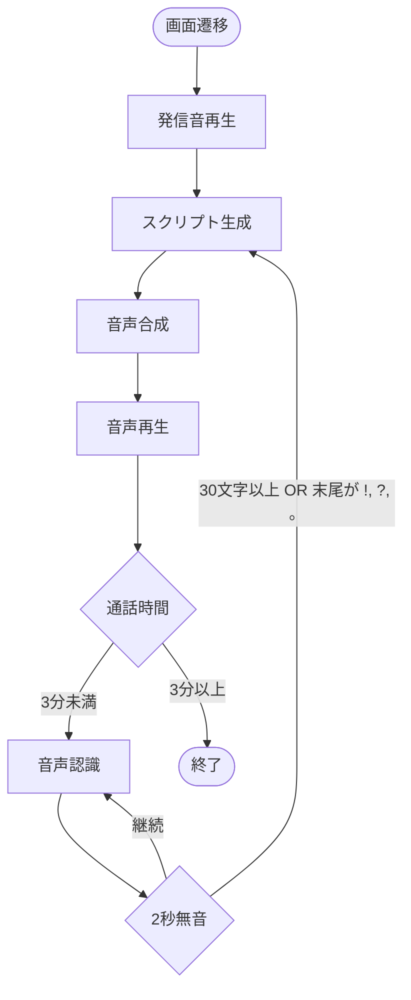

# ZunTalk ドキュメント

## 概要

ZunTalkプロジェクトのドキュメントです。

## Mermaidフローチャートテンプレート

### 基本的なアルゴリズムフローチャート

```mermaid
flowchart TD
    Start([画面遷移]) --> PlayRingbackTone[発信音再生]
    PlayRingbackTone --> ScriptGeneration[スクリプト生成]
    ScriptGeneration --> TextToSpeech[音声合成]
    TextToSpeech --> PlayVoice[音声再生]
    PlayVoice --> CallDuration{通話時間}
    CallDuration -->|3分未満| SpeechRecognition[音声認識]
    CallDuration -->|3分以上| End([終了])
    SpeechRecognition --> SilenceTimeout{2秒無音}
    SilenceTimeout -->|30文字以上 OR 末尾が !, ?, 。| ScriptGeneration
    SilenceTimeout -->|継続| SpeechRecognition
```
