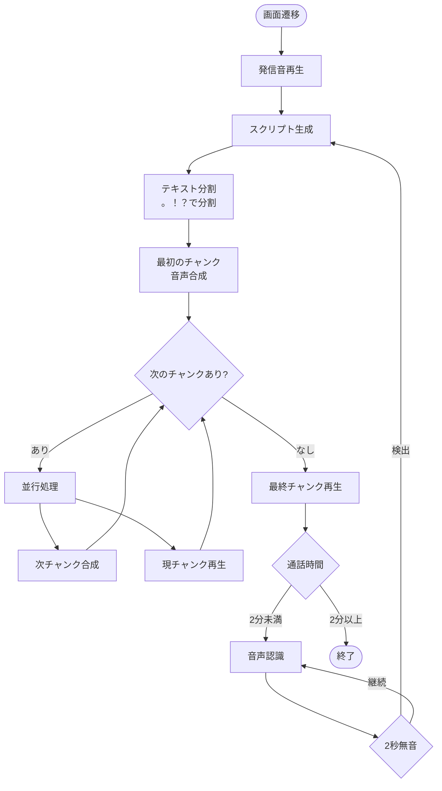
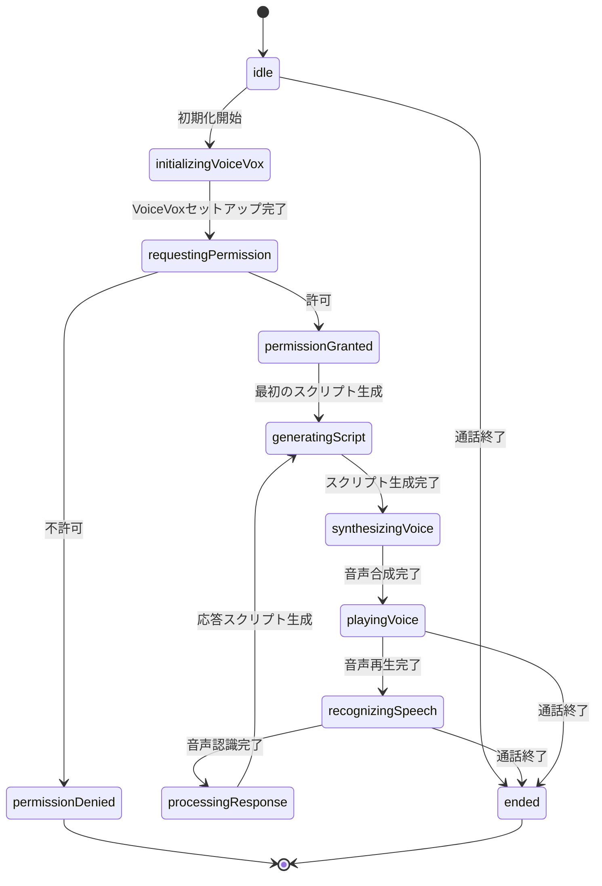

# ZunTalk

## 概要

ZunTalkは、AIを活用した音声通話アプリケーションなのだ！
ずんだもんと楽しく会話できるのだ！

## プロジェクト構成

このリポジトリはモノレポ構成になっています：

- `ios/` - iOSアプリケーション（Swift）
- `backend/` - バックエンドAPI（Go + Echo）

## 開発を始める

### クイックスタート

```bash
# リポジトリをクローン
git clone https://github.com/takoikatakotako/ZunTalk.git
cd ZunTalk

# VOICEVOXリソースをセットアップ（iOSアプリ開発の場合）
make setup-voicevox

# Xcodeでプロジェクトを開く
open ios/ZunTalk.xcodeproj
```

詳しいセットアップ手順は [docs/local-development.md](docs/local-development.md) を参照してください。

## 開発環境

### iOS
- Xcode 15.0以上
- iOS 17.0以上
- AWS CLI（VOICEVOXリソースのダウンロード用）

### Backend
- Go 1.21以上
- Echo v4

## Mermaidフローチャートテンプレート

### 基本的なアルゴリズムフローチャート



### CallStatus 状態遷移図


