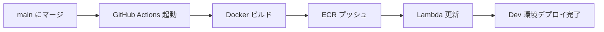
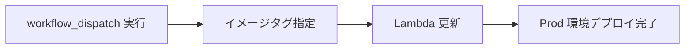

# CI/CD

## GitHub Actions ワークフロー

### iOS Tests

**トリガー:**
- Pull Request（`ios/**`, `Makefile` の変更時）
- Push to main（同上）

**処理内容:**
1. Xcode 16.4でビルド
2. S3からVOICEVOXリソースをダウンロード
3. ユニットテスト実行
4. UIテスト実行（API呼び出しスキップ）

**設定ファイル:** `.github/workflows/ios-test.yml`

### Backend Deploy (Dev)

**トリガー:**
- Push to main（`backend/**` の変更時）
- 手動実行（workflow_dispatch）

**処理内容:**
1. Dockerイメージビルド
2. ECRにプッシュ（sharedアカウント）
3. Lambda関数を更新（devアカウント）

**設定ファイル:** `.github/workflows/backend-deploy-dev.yml`

### Backend Deploy (Prod)

**トリガー:**
- 手動実行のみ（workflow_dispatch）

**処理内容:**
1. 指定されたイメージタグをProd環境にデプロイ
2. Lambda関数を更新

**設定ファイル:** `.github/workflows/backend-deploy-prod.yml`

### Terraform CI

**トリガー:**
- Pull Request（`terraform/**` の変更時）
- Push to main（同上）

**処理内容:**
1. `terraform fmt` チェック
2. `terraform validate`
3. `terraform plan`（PR時のみ）

**設定ファイル:** `.github/workflows/terraform-ci.yml`

### Documentation Deploy

**トリガー:**
- Push to main（`docs/**`, `mkdocs.yml` の変更時）
- 手動実行（workflow_dispatch）

**処理内容:**
1. MkDocsでドキュメントビルド
2. GitHub Pagesにデプロイ

**設定ファイル:** `.github/workflows/docs.yml`

## デプロイフロー

### Dev環境（自動）



1. `backend/**` の変更が main にマージ
2. GitHub Actions が自動起動
3. Dockerイメージをビルド
4. ECR（sharedアカウント）にプッシュ
5. Lambda関数（devアカウント）を更新

### Prod環境（手動）



1. GitHub ActionsでProdデプロイを手動実行
2. ECR内のイメージタグを指定
3. Lambda関数（prodアカウント）を更新

## デプロイ状況確認

### backend-status ワークフロー

現在のデプロイ状況を確認できます：

```bash
gh workflow run backend-status.yml
gh run watch
```

**出力内容:**
- Dev環境の現在のイメージタグ
- Prod環境の現在のイメージタグ
- ECR内の利用可能なイメージ一覧

## OIDC認証

GitHub ActionsからAWSリソースにアクセスする際、OIDC認証を使用：

**メリット:**
- AWS認証情報をSecretに保存不要
- 一時的な認証情報のみ使用
- セキュリティ向上

**設定:**
- IAMロール: `zuntalk-shared-github-actions`
- 信頼ポリシー: GitHubリポジトリのみ許可

## ローカルでの実行

### iOSテスト

```bash
cd ios
xcodebuild test \
  -scheme ZunTalk-Development \
  -sdk iphonesimulator \
  -destination 'platform=iOS Simulator,name=iPhone 16,OS=18.5'
```

### バックエンドテスト

```bash
cd backend
go test ./...
```

### Terraform

```bash
cd terraform/environments/dev
terraform init
terraform plan
```

### ドキュメント

```bash
# ローカルプレビュー
mkdocs serve

# ビルド
mkdocs build
```

## トラブルシューティング

### UIテストがタイムアウトする

**原因:** Lambda のコールドスタート

**対策:** `SKIP-API-CALLS` フラグで API 呼び出しをスキップ

### Dockerビルドが失敗する

**原因:** 依存関係の問題

**対策:**
```bash
# ローカルでビルド確認
docker build -t zuntalk-backend backend/
```

### Terraformエラー

**原因:** 環境変数未設定

**対策:**
```bash
export TF_VAR_openai_api_key="sk-proj-..."
terraform plan
```
